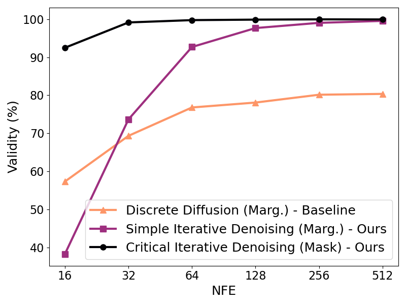

# Simple and Critical Iterative Denoising
### Discrete diffusion: Better, Faster, Simplier

Official code repository for the paper: [Simple and Critical Iterative Denoising](https://arxiv.org/html/2503.21592v1)

<p align="center">
 
</p>

<p align="center">
   
</p>

## Installation

We recommand to install the dependencies in the following order.

1. rdkit [rdkit.org/docs/Install.html](https://www.rdkit.org/docs/Install.html) 

2. pytorch [pytorch.org/get-started/locally/](https://pytorch.org/get-started/locally/)

3. pytorch-geometric [pytorch-geometric.readthedocs.io/en/latest/install/installation.html](https://pytorch-geometric.readthedocs.io/en/latest/install/installation.html)

4. dig [https://diveintographs.readthedocs.io/en/latest/intro/installation.html](https://diveintographs.readthedocs.io/en/latest/intro/installation.html)

5. Anything else in the [requirement.txt](doc/requirements.txt)


For the evaluation of generic graph generation tasks, run the following command to compile the ORCA program (see http://www.biolab.si/supp/orca/orca.html):

```sh
cd graph_stats/orca 
g++ -O2 -std=c++11 -o orca orca.cpp
```

## Training

HEDD is a Hierarchical Equivariant Discrete Diffusion model.

It takes 4 arguments:

```--dataset``` (str.) The dataset to train. Available: 'qm9, ''zinc', 'planar', 'sbm'.

```--work_type``` (str.) Select 'train' or 'sample'.

```--train_model``` and ```--train_critic``` (bool.) If train_model is False and train_critic is True, 
denoiser_dir is required. 

```--wandb``` Wait and bias 'init' argument ('online', 'offline', 'disabled')

```--denoiser_dir``` and ```--critic_dir``` (str.) Path to directory. 


## Datasets

The datasets and splits are automatically downloaded during preprocessing in a folder called 'data'.

## Configuration

The configuration for all experiments are in the 'config' folder. 
The configuration files correspond to the configurations used in our experiments. 

## Licence

 This work is licensed under CC BY-NC-SA 4.0 
 https://creativecommons.org/licenses/by-nc-sa/4.0/
